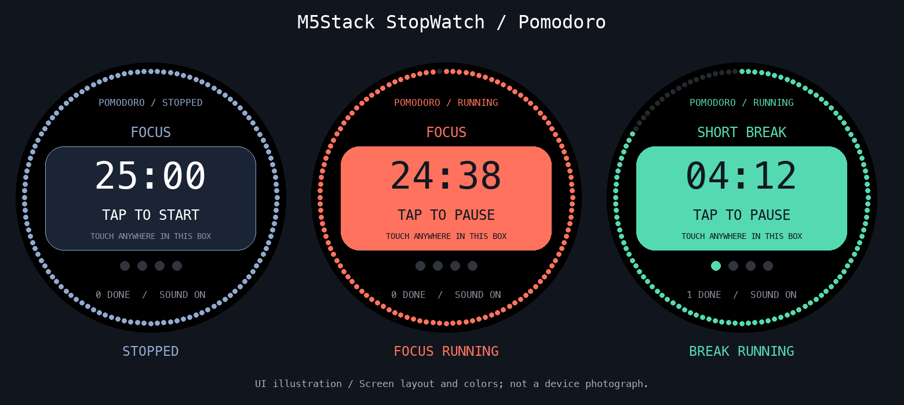

# M5Stack StopWatch Pomodoro

**English:** An offline Pomodoro timer for M5Stack StopWatch, with a large central touch target, color-coded timer states, sound and vibration alerts, and saved progress. [English guide](#english-guide)



画面イメージ（実機写真ではありません）。左：停止中、中央：集中の計測中、右：休憩の計測中。
UI illustration, not a device photograph. Left: stopped. Center: focus running. Right: break running.

M5Stack **StopWatch (C152 / ESP32-S3 / 466×466 AMOLED)** 用の、ネット接続不要のポモドーロタイマーです。

## 使い方

- 集中 **25分** → 短休憩 **5分**。集中を4回完了すると長休憩 **15分**。
- 各区間の終了時に音と振動で通知し、次の区間で待機します。STARTで開始してください。
- 円周に残り時間、中央に分・秒、4つの点にサイクル進捗、下部に累計集中完了数を表示します。
- スキップした集中は完了数に加算されません。
- 停止・一時停止中は落ち着いた青灰色、集中の計測中は明るいコーラル、休憩の計測中はミント色になります。上部の RUNNING / STOPPED でも状態を確認できます。

| 操作 | 動作 |
| --- | --- |
| 黄色ボタン A を短押し | 開始 / 一時停止 |
| 黄色ボタン A を長押し | 現在の区間をスキップ |
| 青色ボタン B を短押し | 通知音 ON / OFF（振動は有効） |
| 青色ボタン B を長押し | 現在の区間の残り時間をリセットして停止 |
| 画面中央の大きな枠内（時間表示を含む）をタップ | 開始 / 一時停止 |
| 画面下部の SOUND | 通知音 ON / OFF |

進捗と音設定は操作時・区間終了時・計測中60秒ごとに保存します。再起動時は保存時点の残り時間で一時停止して復元します。電源OFF中の時間は数えません。突然の電源断では最大約60秒の進捗が失われます。DONEは日単位ではなく累計です。

## ビルド・実機への書き込み

PythonとPlatformIO Coreを用意してください。

```sh
python3 -m pip install platformio
pio run
pio device list
pio run -t upload --upload-port /dev/cu.usbmodem1301
pio device monitor --port /dev/cu.usbmodem1301 --baud 115200
```

ポート名は環境に合わせて置き換えてください。書き込みに応答しない場合、USB接続したまま電源ボタンを約2秒長押しし、緑LEDが点灯したら離すとダウンロードモードになります。書き込み後に起動しない場合は電源ボタンを一度短押ししてください。

公式のPlatformIO構成を基に、16MBフラッシュとOPI PSRAMを有効化しています。M5Unified/M5GFXはコミット固定です。画面と音・振動の初期化にはM5Unifiedを使用します。Wi-Fi、アカウント登録、クラウド連携は不要です。

## テスト

```sh
mkdir -p build
c++ -std=c++11 -Wall -Wextra -Werror -I include test/timer_test.cpp -o build/timer_test
./build/timer_test
```

カウントダウン、一時停止・再開、4回ごとの長休憩、スキップ、リセット、時計カウンタの周回、保存データ復元をテストします。

USBシリアルでは `?` で状態確認、`a` で開始/停止、`r` でリセット、`n` でスキップ、`m` で通知音切り替えができます。USB操作も本体と同じ処理を通ります。

## 公式資料

- [StopWatch仕様・書き込みモード・PlatformIO設定](https://docs.m5stack.com/en/core/StopWatch)
- [ボタンとM5Unified](https://docs.m5stack.com/en/arduino/stopwatch/button)
- [M5Unified](https://github.com/m5stack/M5Unified)
- [M5GFX](https://github.com/m5stack/M5GFX)

## English guide

### What it does

A standalone Pomodoro timer for the **M5Stack StopWatch C152**, featuring a 466×466 round AMOLED display and ESP32-S3. No Wi-Fi, account, or cloud service is required.

- Focus for **25 minutes**, then take a **5-minute short break**. Every fourth completed focus session earns a **15-minute long break**.
- Each interval ends with sound and vibration. The next interval waits for you to start it manually.
- Tap anywhere inside the large central panel, including the countdown digits, to start or pause.
- **Blue-gray = stopped or paused; coral = focus running; mint = break running.** RUNNING / STOPPED labels also communicate the state without relying on color.
- The outer ring shows remaining time, four dots show cycle progress, and DONE is the lifetime count of completed focus sessions. Skipped sessions do not count.

### Controls

| Input | Action |
| --- | --- |
| Tap the large central timer panel | Start / pause |
| Tap SOUND at the bottom | Toggle sound; vibration stays enabled |
| Yellow button A, short press | Start / pause |
| Yellow button A, hold | Skip the current interval |
| Blue button B, short press | Toggle sound |
| Blue button B, hold | Reset the current interval and stop |

Progress and sound settings are saved on interaction, at interval completion, and every 60 seconds while running. After reboot, the timer restores the last saved remaining time **paused**. Powered-off time is not counted; sudden power loss can lose up to approximately 60 seconds of progress.

### Build and flash

Install Python and PlatformIO Core, then run from this repository:

```sh
python3 -m pip install platformio==6.1.19
pio run
pio device list
pio run -t upload --upload-port /dev/cu.usbmodem1301
```

Replace the port with your device's port (for example, `COM3` on Windows). If flashing cannot connect, keep USB connected, hold the power button for about two seconds until the green LED turns on, then release it. If the app does not start after flashing, briefly press the power button once.

The firmware enables 16 MB flash and OPI PSRAM using M5Stack's documented PlatformIO configuration. M5Unified and M5GFX dependencies are pinned to specific commits.

### Tests and diagnostics

```sh
mkdir -p build
c++ -std=c++11 -Wall -Wextra -Werror -I include test/timer_test.cpp -o build/timer_test
./build/timer_test
pio device monitor --port /dev/cu.usbmodem1301 --baud 115200
```

The timer tests cover countdown, pause/resume, the four-session cycle, skipping, reset, clock rollover, and saved-state restoration. GitHub Actions builds the firmware and runs these tests.

USB serial commands: `?` reports status, `a` starts/pauses, `r` resets, `n` skips, and `m` toggles sound. These use the same actions as the device controls.
